<picture>
  <source media="(prefers-color-scheme: dark)" srcset="assets/banner-dark.svg">
  <source media="(prefers-color-scheme: light)" srcset="assets/banner-light.svg">
  
</picture>

  
  
  
  

## Sobre mim

Sou o Daniel, fundador da **[PazConcept](https://www.pazconcept.com.br)**. Comecei pelo design — identidade visual e branding — e hoje uso o mesmo olhar para construir software: sistemas web e apps que resolvem problemas reais de negócios brasileiros, do consultório de nutrição à oficina mecânica.

Gosto de cuidar do produto inteiro: da marca e da interface até o banco de dados, os testes e o deploy.

- 🏢 **PazConcept** — sistemas & design, do logotipo ao SaaS em produção
- 🧱 **Hoje:** SaaS em **Next.js 16 + PostgreSQL** (Prisma ou Supabase), rodando na Vercel
- 📱 **Mobile:** apps em **React Native CLI** para Android e iOS
- 🧪 **Qualidade:** mais de 1.000 arquivos de teste entre Vitest, Playwright e pgTAP
- 🇧🇷 **Feito para o Brasil:** Pix, NFC-e, WhatsApp e alertas no Telegram

## O que estou construindo

| | Projeto | O que é | Stack |
| :-: | :--- | :--- | :--- |
| 🟢 | **[DietSpace](https://dietspace.com.br)** | Gestão nutricional para consultório: anamnese, antropometria, planos alimentares e portal do paciente (PWA) | Next.js · Prisma · Neon · Auth.js |
| 🟢 | **[PerformX](https://performx.pazconcept.com.br)** | Plataforma para personal trainer: biblioteca de exercícios, montador de ficha e app do aluno com timer | Next.js · Prisma · Neon · PWA |
| 🟡 | **[PitSpace](https://pitspace.pazconcept.com.br)** | Gestão de oficinas mecânicas: OS pela placa, orçamento aprovado pelo cliente via link, estoque e caixa | Next.js · Prisma · Supabase · S3 |
| 🟡 | **[ElaraSpace](https://elaraspace.pazconcept.com.br)** | Ocorrências de entrega para distribuidoras: PWA offline do motorista, painel em tempo real e aviso no WhatsApp | React · Vite · Supabase Realtime · Baileys |
| 🔵 | **Pronto!** | Autoatendimento para lanchonetes: totem, PDV, cozinha (KDS), painel de senhas, Pix e NFC-e | React · Supabase Edge Functions · Mercado Pago |
| 🟢 | **GestaoHub** | Operação de varejo em três camadas: app de validade e conferência, painel web de BI e BFF | React Native · React · Express · Supabase |
| 🟢 | **[PazConcept](https://www.pazconcept.com.br)** | Site da PazConcept, com um universo de estrelas interativo em canvas | Next.js · Framer Motion |

🟢 no ar · 🟡 piloto / beta · 🔵 em desenvolvimento — a maioria é privada; os públicos estão abaixo.

<b>Apps, jogos e ferramentas</b>

 

| Projeto | O que é | Stack |
| :--- | :--- | :--- |
| **[Foteball-app](https://github.com/Danpazexe/Foteball-app)** | Jogo de gerência de futebol brasileiro estilo Brasfoot, com Séries A a D e mercado de transferências | React Native 0.86 · Reanimated 4 · op-sqlite · Zustand |
| **[Comanda-app](https://github.com/Danpazexe/Comanda-app)** | Comandas para restaurante: mesas, pedidos, monitor de cozinha e relatórios | React Native · Firebase · Vite |
| **Palavrix** | Jogo de adivinhação de palavras em português, estilo Termo | React Native · Lottie |
| **BrainVault** | Cérebro digital em Markdown versionado, com CLI, interface web, captura pelo Telegram e servidor MCP | Node.js · GitHub Actions · MCP |
| **Central de Deploys** | Painel em tempo real dos meus projetos na Vercel: deploys, tempo de build, ping dos sites e vulnerabilidades | Next.js · APIs da Vercel e do GitHub |
| **[ServidorPaz-infra](https://github.com/Danpazexe/ServidorPaz-infra)** | Servidor Minecraft Paper com plugins, datapacks e um plugin Java próprio | Java 17 · Gradle · Paper |

## Stack

<picture>
  <source media="(prefers-color-scheme: dark)" srcset="assets/stack-icones-dark.svg">
  <source media="(prefers-color-scheme: light)" srcset="assets/stack-icones-light.svg">
  
</picture>

## Números

  <picture>
    <source media="(prefers-color-scheme: dark)" srcset="https://github-readme-stats-seven-livid-24.vercel.app/api?username=Danpazexe&show_icons=true&theme=github_dark&hide_border=true&count_private=true&bg_color=0d1117">
    
  </picture>
  <picture>
    <source media="(prefers-color-scheme: dark)" srcset="https://github-readme-stats-seven-livid-24.vercel.app/api/top-langs/?username=Danpazexe&layout=compact&theme=github_dark&hide_border=true&langs_count=6&bg_color=0d1117">
    
  </picture>

<picture>
  <source media="(prefers-color-scheme: dark)" srcset="https://raw.githubusercontent.com/Danpazexe/Danpazexe/output/github-contribution-grid-snake-dark.svg">
  <source media="(prefers-color-scheme: light)" srcset="https://raw.githubusercontent.com/Danpazexe/Danpazexe/output/github-contribution-grid-snake.svg">
  
</picture>

Banner e card de stack gerados por <code>assets/gerar.py</code>.

